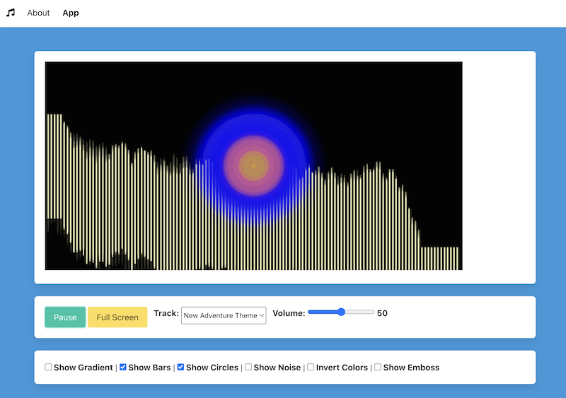
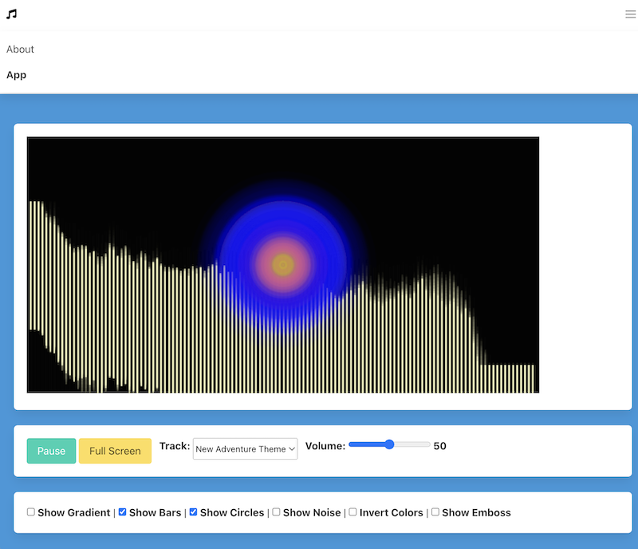
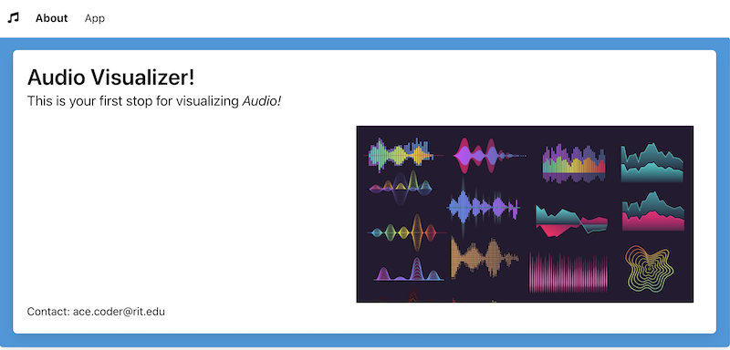
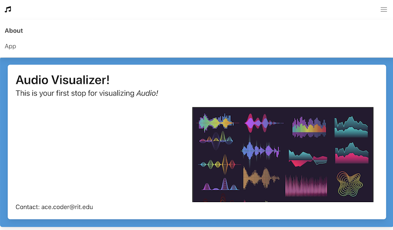

# HW3 - Bulma Requirements

## I. An 'About' Page is required
- A good starting point is **home.html** from [PE-08 - Bulma I - Intro to Bulma](../pe/pe-08.md)
- The name of the page must be **about.html**
  - give the `<title>` tag a meaningful value
- It must have a navigation system that includes a functional hamburger menu that will toggle its appearance when clicked
- It must have text that describes the project (meaning, get rid of the "hotdog" text)
- It must have at least one image that is related to the project (meaning, get rid of the "hotdog" image)
- It must have your contact info on it (meaning, get rid of Ace Coder's info)
- The colors chosen for backgrounds/fonts etc should be consistent with **index.html**
- Get rid of the Hotdog icon (unless your project is about hot dogs):
  - here are some ideas: https://fontawesome.com/search?q=audio&o=r&m=free
- To keep the hamburger menu functional, rename **index.js** to **hamburger.js** and import it with a `<script>` tag
- See example screenshots below


---

## II. An 'App' Page is required
- A good starting point is **home.html** from [PE-08 - Bulma I - Intro to Bulma](../pe/pe-08.md)
  - NB: if you are going to have multiple columns and/or rows in your app page layout (almost a certainty), you will also want to review PE-08's "index" pages that demoed how to lay out columns and rows in Bulma 
- The name of the page must be **index.html**
  - give the `<title>` tag a meaningful value
- It must have a navigation system that includes a functional hamburger menu that will toggle its appearance when clicked
- Get rid of the Hotdog icon (unless your project is about hot dogs)
  - here are some ideas: https://fontawesome.com/search?q=audio&o=r&m=free
- The colors chosen for backgrounds/fonts etc should be consistent with **about.html**
- To keep the hamburger menu functional, rename **index.js** to **hamburger.js** and import it with a `<script>` tag OR move that code to `setupUI()` or similar
- See example screenshots below

---

## III. FAQ

- ***Do I have to do ALL of my styles with Bulma or can I still use plain-old CSS?***
  - you will likely find the need to keep some of your "old" CSS - for example the button behaviors. Below is what I kept around for the sample HW-3:
 
**styles/default-styles.css**

```css
button[data-playing="yes"]:after{
  content: "Pause";
}

button[data-playing="no"]:after{
  content: "Play";
}
```

---

## IV. Screenshots

### index.html 
- Note that **"App"** is bolded while "About" is not
- Note that the Font Awesome hotdog icon has been replaced


---

### index.html (mobile)
- Note that **"App"** is bolded while "About" is not
- Note that the Font Awesome hotdog icon has been replaced
- Note the functional hamburger menu
- ***Note: It's OK if your `<canvas>` is not fully responsive and does not shrink to fit the screen***


---

### about.html
- Note that **"About"** is bolded while "App" is not
- Note that the Font Awesome hotdog icon has been replaced


---

### about.html (mobile)
- Note that **"About"** is bolded while "App" is not
- Note that the Font Awesome hotdog icon has been replaced
- Note the functional hamburger menu

